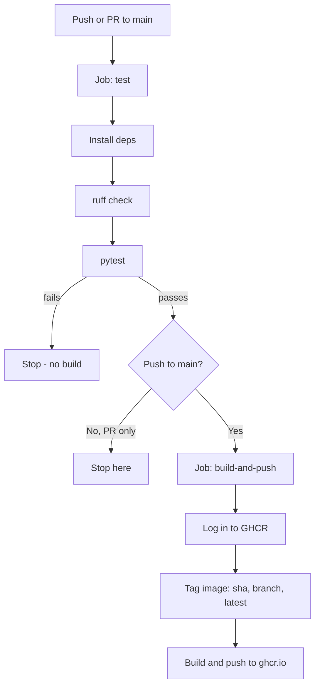

# API CI/CD Workflows

FastAPI + Docker + GitHub Actions + GHCR.

## Features
- FastAPI
- Pytest
- Ruff
- Docker
- GitHub Actions CI
- GHCR publishing

## Project structure
```
src/
  api/
    main.py          # FastAPI app, includes routers
    core/
      config.py       # app settings
    routers/
      health.py        # GET /health
      version.py       # GET /api/version
  tests/
    test_health.py
    test_version.py
```

## Endpoints
- `GET /health` — health check
- `GET /api/version` — service name and version
- Swagger UI: `/docs`

## Configuration
Loaded from env vars or `.env` (via `pydantic-settings`). Copy `.env.example` to `.env`:
- `APP_NAME` — default `api-cicd-workflows`
- `APP_VERSION` — default `1.0.0`

## Run locally
```
pip install -r requirements.txt
cp .env.example .env
uvicorn src.api.main:app --reload
```

## Test
```
pytest
```

## Docker
```
docker build -t api-cicd-workflows .
docker run -p 8000:8000 api-cicd-workflows
```

## CI/CD workflow
Defined in [`.github/workflows/ci.yml`](.github/workflows/ci.yml):



- **`test`** — lint + pytest, on every push/PR to `main`.
- **`build-and-push`** — only after `test` passes, only on push to `main`. Pushes to `ghcr.io/<owner>/<repo>`.

### Example: test the flow

**Step 1 — Test locally, before pushing anything**
```bash
actionlint .github/workflows/ci.yml   # lint the workflow file
act -j test                           # run the `test` job locally
```

**Step 2 — Push a branch and open a PR (triggers `test` only)**
```bash
git checkout -b my-branch
git add -A
git commit -m "My changes"
git push -u origin my-branch
gh pr create --fill
gh pr checks   # test should pass, build-and-push should skip
```

**Step 3 — Merge to `main` (triggers `test` + `build-and-push`)**

`pr-number` identifies which PR to merge — optional if you're still on the branch that opened it, since `gh` infers it from there. To find it, run:
```bash
gh pr list
```
Example output (the number is under `ID`):
```
Showing 1 of 1 open pull request in WeerayutBu/api-cicd-workflows

ID  TITLE       BRANCH     CREATED AT
#1  My changes  my-branch  about 10 minutes ago
```
Then merge:
```bash
gh pr merge [pr-number] --merge
```

Either way, make sure everything is committed and pushed first (`git status` should say "nothing to commit"), then check the **Actions** tab (both jobs run) and **Packages** tab (new image published) on GitHub afterward.

## Setup github workflows
Use official installers, not the Snap Store — `actionlint`/`act` snaps under those names are unrelated packages.

| Description | Command |
|---|---|
| Install `actionlint` | `bash <(curl https://raw.githubusercontent.com/rhysd/actionlint/main/scripts/download-actionlint.bash) && sudo mv ./actionlint /usr/local/bin/` |
| Lint the workflow | `actionlint .github/workflows/ci.yml` |
| Install `act` | `curl -s https://raw.githubusercontent.com/nektos/act/master/install.sh \| sudo bash` |
| Run `test` job locally | `act -j test` |
| Run full pipeline locally | `act push` (GHCR push needs a real token) |
| Verify for real | Push/PR triggers `test`; merge to `main` triggers both — check **Actions** and **Packages** tabs |

## Next steps
- **Deploy the image** — GHCR only stores it; add a deploy step to actually run it somewhere public.
- **Add branch protection on `main`** — require `test` to pass before merge.
