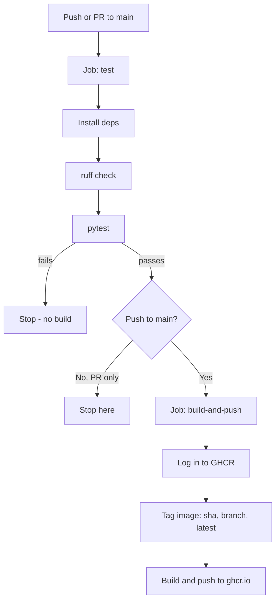

# API CI/CD Workflows

FastAPI + Docker + GitHub Actions + GHCR.

## Features
- FastAPI
- Pytest
- Ruff
- Docker
- GitHub Actions CI
- GHCR publishing

## Project structure
```
src/
  api/
    main.py          # FastAPI app, includes routers
    core/
      config.py       # app settings
    routers/
      health.py        # GET /health
      version.py       # GET /api/version
  tests/
    test_health.py
    test_version.py
```

## Endpoints
- `GET /health` — health check
- `GET /api/version` — service name and version
- Swagger UI: `/docs`

## Configuration
Settings are loaded from environment variables (or a local `.env` file, via `pydantic-settings`). Copy `.env.example` to `.env` to customize:
- `APP_NAME` — service name (default `api-cicd-workflows`)
- `APP_VERSION` — service version (default `1.0.0`)

## Run locally
```
pip install -r requirements.txt
cp .env.example .env
uvicorn src.api.main:app --reload
```

## Test
```
pytest
```

## Docker
```
docker build -t api-cicd-workflows .
docker run -p 8000:8000 api-cicd-workflows
```

## Push to GitHub
This repo has no commits or remote yet. First, create an empty repo on GitHub (via the web UI or `gh repo create`), then:

| Description | Command |
|---|---|
| Stage all files | `git add .` |
| Commit | `git commit -m "Initial commit"` |
| Rename branch to `main` (current branch is `master`; the CI workflow only triggers on `main`) | `git branch -M main` |
| Link the GitHub repo as `origin` | `git remote add origin https://github.com/<user>/<repo>.git` |
| Push and set upstream | `git push -u origin main` |

After this first push, `git push` alone is enough for subsequent commits — and it'll trigger the `test` job automatically (see below).

## CI/CD workflow
Defined in [`.github/workflows/ci.yml`](.github/workflows/ci.yml). Two jobs, gated in sequence:



- **`test`** runs on every push and PR targeting `main` — lint (ruff) then tests (pytest). A failure here stops the pipeline.
- **`build-and-push`** only runs after `test` passes, and only for a push to `main` (not PRs) — so opening a PR gives you lint/test feedback without publishing an image. It logs into GHCR with the auto-generated `secrets.GITHUB_TOKEN`, tags the image with the commit SHA, branch name, and `latest`, then pushes to `ghcr.io/<owner>/<repo>`.

See [Testing GitHub workflows](#testing-github-workflows) below to try it locally before pushing.

## Testing GitHub workflows
Avoid the Snap Store for `actionlint`/`act` — both snaps under those names are unrelated/mismatched packages, not the real tools. Use the official install scripts below.

| Description | Command |
|---|---|
| Install `actionlint` (official binary) | `bash <(curl https://raw.githubusercontent.com/rhysd/actionlint/main/scripts/download-actionlint.bash) && sudo mv ./actionlint /usr/local/bin/` |
| Lint the workflow file | `actionlint .github/workflows/ci.yml` |
| Install `act` (official script) | `curl -s https://raw.githubusercontent.com/nektos/act/master/install.sh \| sudo bash` |
| Run just the `test` job locally | `act -j test` |
| Run the full pipeline locally (GHCR push step fails without a real token) | `act push` |
| Verify the `test` job for real | Push a branch or open a PR, then check the **Actions** tab |
| Verify the `build-and-push` job for real | Merge the PR into `main`, then check **Actions** and the **Packages** tab |
